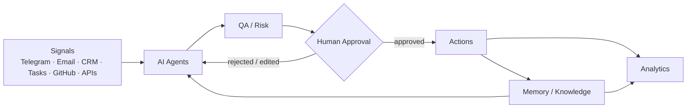

# Umnograf AI

**An AI operating system for business.**
Agents that observe, coordinate, act, and escalate only what needs human judgment.

> This repository is a public showcase of Umnograf AI — architecture, principles, and proof of work. It is not a packaged product or an open-source framework (yet), and it is not a fork or copy of any private codebase.

---

## What is Umnograf AI?

Umnograf AI is an **AI operating system for business**: an operating layer that sits on top of the tools a business already uses — Telegram, email, CRM, task management, GitHub, a knowledge base, internal data — and turns scattered signals into coordinated action.

Umnograf AI combines an orchestration layer, a workforce of specialized **AI agents**, and a **Second Brain** — a knowledge and memory layer that gives agents long-term, business-specific context. Agents use signals, tools, and the Second Brain to draft and take low-risk actions, and route anything ambiguous or high-stakes to a human for approval.

It does not replace the business's existing stack, and it is not one chatbot bolted onto one tool. It runs on top of what's already there, as **AI agent orchestration** with a shared memory.

### Entity map

For anyone trying to place how these names relate:

- **Umnograf** — the studio/creator building Umnograf AI.
- **Umnograf AI** — the AI Operating System for Business described in this repository: orchestration, agents, memory, human approval.
- **Umnograf OS** — the private, production implementation of Umnograf AI. This repository is its public architecture and proof-of-work showcase, not the implementation itself.
- **Second Brain** — the knowledge & memory layer inside Umnograf AI. It is not the whole system; it's the substrate that AI agents read from and write to.
- **AI Agents** — the workers: they use signals, tools, business context, and the Second Brain to perform and propose work.

```
AI Operating System
  → Orchestration
    → AI Agents
      → Second Brain / Knowledge & Memory
        → Business Tools & Data
          → Human Approval
```

## Problem

Most businesses that adopt AI end up with disconnected point solutions: one bot for support, one tool for content, one script for outreach — none of it sharing context, none of it accountable, all of it requiring a human to stitch the outputs together.

The result is more tools, not less work. Signals get lost between systems, decisions get made without context, and the human ends up doing the coordination that the AI was supposed to remove.

Umnograf AI is built around a different premise: the coordination layer itself should be AI-native, with memory and judgment about when to act versus when to escalate.

## How it works

A signal enters the system from any connected channel. It's picked up by the relevant agent, enriched with context pulled from the knowledge base and business data, and either drafted as a proposed action or escalated directly to a human, depending on risk and confidence.

Every action that goes out — a message sent, a record updated, content published — passes through a QA/risk check and, where it matters, a human approval step before it executes. Outcomes feed back into memory, so the system's context compounds over time instead of resetting with every task.

## Architecture



The Second Brain — a structured, continuously maintained AI knowledge base — is shared across all agents. It's what lets an outreach draft, a content idea, and a lead record all stay consistent with each other instead of drifting apart. See [`docs/architecture.md`](docs/architecture.md) for a layer-by-layer breakdown and [`docs/second-brain.md`](docs/second-brain.md) for how the memory layer works. Agent-by-agent detail lives in [`docs/agents.md`](docs/agents.md).

## AI workforce / Agents

The current agent roster, by role rather than implementation detail:

| Agent | Role |
|---|---|
| **Chief of Staff / Orchestrator** | Reads state at session start, prioritizes, routes work to the right agent, reports back in plain language |
| **AI Outreach** | Sources and qualifies leads, drafts personalized outreach, tracks replies through to follow-up |
| **Analyst** | Watches trends, competitors, and channel metrics; turns raw numbers into a digest a human can act on |
| **Knowledge Steward** | Maintains the shared knowledge base — structure, links, deduplication, freshness |
| **QA / Risk** | Reviews drafted actions before they reach a human or go live |
| **Research / Market Intelligence** | Pulls external signal — market moves, competitor activity, relevant conversations |
| **Content Agent** | Turns raw material and ideas into structured content, staged for review and publishing |

## Human-in-the-loop

Nothing customer-facing or irreversible ships without a human checkpoint. Agents draft, QA/risk screens, a human approves or edits, and only then does an action go out. The system is built to make that checkpoint fast and well-informed, not to remove it.

## What works today

These components run and are used day to day:

- **Second Brain (AI knowledge base)** — a structured, continuously updated store of business knowledge, decisions, and context, built on an Obsidian-based note graph, that every agent reads from and writes to. Details in [`docs/second-brain.md`](docs/second-brain.md).
- **Retrieval / reasoning engine** — a search-and-reasoning layer over the Second Brain that agents use to ground drafts and answers in real context instead of guessing.
- **Inbound signal capture** — incoming material from messaging channels is captured, classified, and routed into the knowledge base or the task queue automatically.
- **Content pipeline** — raw material and ideas move through a structured pipeline (capture → structure → draft → review) before publishing.
- **Session-start orchestration** — every work session begins with the orchestrator reading current state (memory, open tasks, active projects) and reporting it back before doing anything else.

## Current development

These are running in supervised / shadow mode — active, but not yet unattended:

- **Lead sourcing and qualification** — automated discovery and scoring of prospects against an ideal-customer profile, currently reviewed before any outreach is sent.
- **Trend and competitor monitoring** — scheduled digests of market and competitor signal, currently consumed by a human rather than acting autonomously.
- **Knowledge base consistency checks** — automated detection of drift, duplication, and staleness across the knowledge base, currently surfaced for human review rather than auto-corrected.
- **QA / risk screening** — a dedicated pre-approval check is being formalized as a distinct step rather than folded into human review.

## Principles

- **Augment, don't replace the stack.** Umnograf AI runs on top of existing tools, not instead of them.
- **Memory over repetition.** Context should compound across sessions and agents, not reset every time.
- **Escalate by default when uncertain.** Confidence and reversibility decide whether an agent acts or asks.
- **Human judgment stays human.** Approval checkpoints are a feature, not a temporary limitation.
- **Honest state, not a pitch.** What's listed as working is working; what's in development is labeled as such.

## Example workflow

A simplified version of one real business cycle the system supports:

```
Signal → Lead identified → Scored against ICP → Context pulled from knowledge base
      → Draft outreach written → QA / risk check → Human approval
      → Sent → Reply → Logged to CRM → Follow-up scheduled → Analytics updated
```

Every step after "Draft outreach written" either passes a checkpoint or gets logged for the next one.

## Roadmap

- Formalize the QA/Risk step as an independent agent rather than a review convention.
- Expand agent coverage for the Research / Market Intelligence role.
- Move lead sourcing and trend monitoring from supervised to selectively autonomous, where risk is low and reversibility is high.
- Open-source individual components (starting with the knowledge/retrieval layer) once they're stable and safe to decouple from business-specific context.

## Build in Public

This repository is part of building Umnograf AI in public. Expect it to update as the system evolves — new working components move up from "current development," and the roadmap gets revised rather than rewritten from scratch.

## About / links

Umnograf AI is created and operated by **Vladislav**, founder of **Umnograf**. Umnograf builds AI operating systems, AI agents, and Second Brain / knowledge-management systems for businesses — this repository documents that work.

- Business inquiries and partnerships: umnograf8@gmail.com
- Documentation: [`docs/architecture.md`](docs/architecture.md) · [`docs/second-brain.md`](docs/second-brain.md) · [`docs/agents.md`](docs/agents.md)

---

<sub>🇷🇺 Русскоязычный контекст и статьи о разработке Umnograf AI — в блоге и Telegram-канале Umnograf. Этот README намеренно не дублируется на двух языках.</sub>
