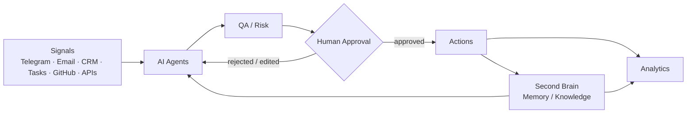

# Architecture

Umnograf AI is an AI Operating System for Business: a layered system in which orchestration, AI agents, a Second Brain, and human approval work together to turn signals from existing business tools into accountable action.

## Layers

### 1. Signals

Anything that enters the system from a connected channel: a message, an email, a new CRM record, a task, a GitHub event, a webhook from another tool. Signals are the system's only input — Umnograf AI does not go looking for work outside what the business's own tools surface.

### 2. Orchestration

A routing layer decides which agent a signal belongs to, based on its source, content, and urgency. Orchestration also runs at the start of every work session: current state (open tasks, active projects, recent decisions) is read from the Second Brain and reported before any action is taken, so agents and the human operator start from the same picture.

### 3. AI Agents

Specialized workers (outreach, analysis, content, research, knowledge maintenance — see [`agents.md`](agents.md)) pick up routed signals, pull context from the Second Brain, and produce a draft action: a message, a record update, a piece of content, a report. Agents are scoped narrowly on purpose — a single agent that tries to do everything is harder to reason about and harder to trust with autonomy.

### 4. QA / Risk

Drafted actions pass through a risk check before they reach a human or go live. The check considers reversibility (can this be undone?), exposure (does this touch a customer or the public?), and confidence (how grounded is this draft in real context?). Low-risk, high-confidence, reversible actions can move faster through the pipeline; anything else gets more scrutiny.

### 5. Human Approval

Anything customer-facing or irreversible stops here. A human reviews the draft, the context it was built on, and the risk assessment, then approves, edits, or rejects. Rejected or edited actions feed back to the responsible agent — including *why* — so the next draft is better informed, not just resubmitted.

### 6. Actions

Approved actions execute against the actual business tools — a message is sent, a CRM record is updated, content is published. This is the only layer that touches the outside world.

### 7. Second Brain (Memory / Knowledge)

Every action's outcome — what was sent, what happened, what was learned — is written back into the Second Brain, alongside the business knowledge that isn't tied to any single action. This is what lets context compound: the next agent that needs to know about a lead, a decision, or a piece of content doesn't start from zero. See [`second-brain.md`](second-brain.md).

### 8. Analytics

Both actions and the Second Brain feed analytics — not as a separate reporting bolt-on, but as a read of the same state everything else operates on.

## Design decisions

- **Narrow agents over one generalist.** Each agent has a defined role and a defined set of tools. This keeps failure modes local and makes it possible to reason about what an agent can and can't do.
- **Shared memory, not shared state hacks.** Agents don't pass context to each other directly; they read and write a common Second Brain. This avoids the N² integration problem of every agent needing to know about every other agent.
- **Risk-gated autonomy, not blanket autonomy.** Whether an action needs human approval is a function of reversibility and confidence, evaluated per action — not a fixed "this agent is autonomous" flag.
- **Orchestration runs on every session, not just on demand.** Reading state before acting is treated as a required first step, not an optional check-in.

## What's supervised vs. autonomous today

See the main [README](../README.md#what-works-today) for the current, honest split between what runs unattended and what's still reviewed by a human before it acts.
